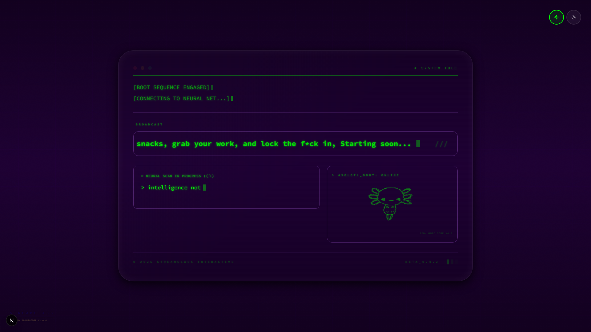
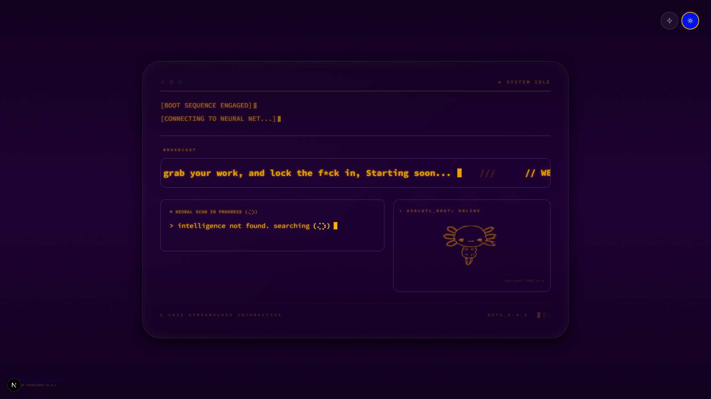

# StreamGlass Terminal

A retro-futuristic "Starting Soon" overlay for Twitch streams. Blends Apple Vision Pro's floating glass UI with 80s Macintosh/VT100 terminal aesthetics — CRT scanlines, phosphor glow, typewriter animations, and an ASCII axolotl mascot.




## Features

- **Boot sequence animation** — Progressive reveal with typewriter text effects and a blinking block cursor
- **Broadcast ticker** — Scrolling marquee with your custom welcome message
- **Scanning terminal** — Animated cycling messages with a Braille UTF-8 spinner
- **ASCII axolotl** — Wiggling mascot in a dedicated auxiliary panel
- **Theme switching** — Toggle between neon green (`#00FF00`) and amber (`#FFB000`) terminal palettes
- **Glass morphism** — Translucent terminal window with glow borders, parallax mouse tracking, and 80s-Mac rounded corners
- **CRT effects** — Scanline overlay, subtle flicker, phosphor glow, and reflective glass sheen
- **Animated background** — Slowly scrolling grid with hexagonal wireframe patterns and depth vignette

## Tech Stack

| Layer | Technology |
|-------|-----------|
| Framework | Next.js 15 (App Router, Turbopack) |
| Language | TypeScript |
| UI | React 19 |
| Styling | Tailwind CSS + tailwindcss-animate |
| Components | shadcn/ui (Radix UI) |
| Fonts | Source Code Pro (terminal), Inter (UI) |
| AI | Google Genkit + Gemini 2.5 Flash |
| Hosting | Firebase App Hosting |

## Getting Started

### Prerequisites

- Node.js 18+
- npm

### Install & Run

```bash
npm install
npm run dev
```

The overlay runs at [http://localhost:9002](http://localhost:9002).

### OBS Setup

1. Add a **Browser Source** in OBS
2. Set the URL to `http://localhost:9002`
3. Set width to `1920` and height to `1080`
4. Check "Shutdown source when not visible" to save resources

### Build for Production

```bash
npm run build
npm start
```

## Project Structure

```
src/
├── app/
│   ├── page.tsx              # Entry point — assembles background, terminal, and theme toggle
│   ├── layout.tsx            # Root layout with fonts and metadata
│   └── globals.css           # Theme variables, terminal glow classes, glass morphism
├── components/
│   ├── terminal/
│   │   ├── TerminalWindow.tsx    # Main terminal container with boot sequence logic
│   │   ├── TypewriterText.tsx    # Typewriter animation with completion callback
│   │   ├── ScanningTerminal.tsx  # Cycling scan messages with Braille spinner
│   │   ├── Axolotl.tsx           # ASCII art axolotl with wiggle animation
│   │   ├── BackgroundGrid.tsx    # Animated grid/wireframe background
│   │   └── ThemeToggle.tsx       # Green/amber theme switcher
│   └── ui/                       # shadcn/ui component library
└── ai/
    └── flows/                    # Genkit AI flows for generating idle animations
```

## How It Works

The overlay follows a timed boot sequence:

1. **Stage 0** — Page loads, background grid and CRT effects active
2. **Stage 1** — `[BOOT SEQUENCE ENGAGED]` types out
3. **Stage 2** — `[CONNECTING TO NEURAL NET...]` types out, broadcast ticker appears
4. **Stage 3** — Diagnostics grid fades in (scanning terminal + axolotl)

All animations loop seamlessly. The terminal window floats with a gentle parallax effect that tracks mouse position.

## Customization

### Change the broadcast message

Edit `broadcastMessage` in `src/components/terminal/TerminalWindow.tsx`:

```typescript
const broadcastMessage = "// YOUR MESSAGE HERE";
```

### Change the scanning messages

Edit the `messages` array in `src/components/terminal/ScanningTerminal.tsx`:

```typescript
const messages = [
  "> your first message",
  "> your second message"
];
```

### Adjust animation speeds

Keyframes and durations are defined in `tailwind.config.ts` under `theme.extend.keyframes` and `theme.extend.animation`.

## License

Private project.
